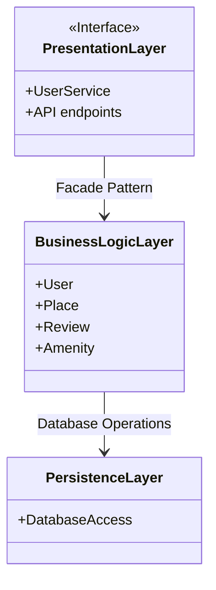

### 📄 Explanatory Notes

#### 🌟 Layer Descriptions

✅ **Presentation Layer**
This layer represents the **user-facing interface** of the application. It contains the **user services** and **API endpoints** that receive client requests (e.g., from users or external applications consuming the API). Its role is to **handle user interactions** and **forward requests to the business logic layer**.

✅ **Business Logic Layer**
This is the **core of the application**. It contains the **domain models** such as `User`, `Place`, `Review`, and `Amenity`. These models define the rules and behaviors of the application’s entities. This layer **processes the business logic** (e.g., validation, calculations) and **orchestrates** the necessary actions.

✅ **Persistence Layer**
This layer manages **data access**. It is responsible for the **storage and retrieval** of information in the database (through components like `DatabaseAccess`). It **isolates** the business logic from the technical details of data storage.

---

#### 💡 How the Facade Pattern Facilitates Communication

The **facade design pattern** is represented in the diagram by the **arrow from the Presentation Layer to the Business Logic Layer**:

- The facade acts as a **single entry point** for the services in the Presentation Layer.
- Instead of having to directly interact with all the models (`User`, `Place`, etc.), the Presentation Layer simply calls the **facade**.
- The facade **hides the complexity** and **coordinates the necessary calls** to the business logic.
- This makes the code **clearer, more modular**, and **easier to maintain**.

In summary, the facade **simplifies interactions** and **strongly decouples** the Presentation Layer from the Business Logic Layer, while ensuring the Business Logic can **cleanly** interact with the Persistence Layer for data management.

