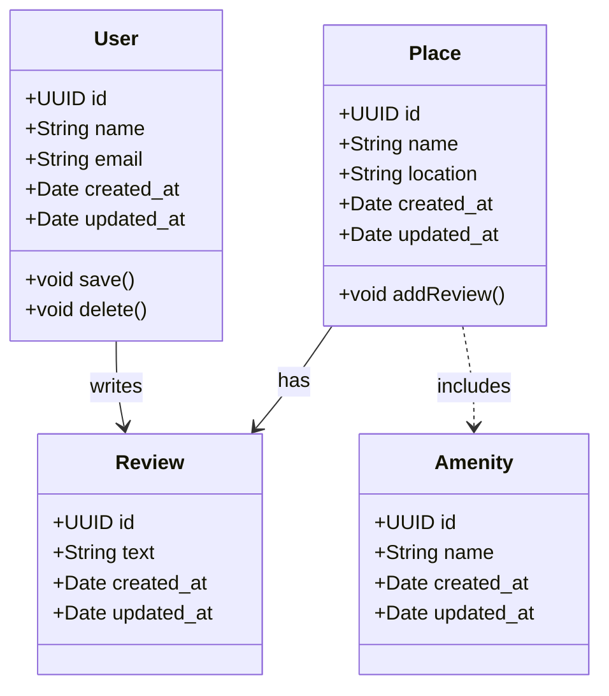

### 📄 Explanatory Notes

#### 🌟 Description of Each Entity

✅ **User**
The `User` class represents a person who interacts with the HBnB system. Key attributes include:
- `id`: a unique identifier (UUID4),
- `name` and `email`,
- `created_at` and `updated_at` timestamps.
Key methods are:
- `save()`: to save or update the user,
- `delete()`: to remove the user from the system.
The `User` plays an essential role in writing reviews and interacting with places.

✅ **Place**
The `Place` class models an accommodation offered by HBnB. It has:
- `id`, `name`, and `location` to identify and describe it,
- timestamps for tracking creation and updates.
A key method:
- `addReview()`: allows adding a new review to the place.
The `Place` entity connects directly to both reviews and amenities.

✅ **Review**
The `Review` class represents feedback from a user about a place. It has:
- `id` and `text` to uniquely identify and contain the review content,
- timestamps for tracking when the review was created or updated.
Reviews provide critical feedback and insights for other users.

✅ **Amenity**
The `Amenity` class represents additional features that a place can offer (like Wi-Fi, pool, etc.). It includes:
- `id` and `name`,
- timestamps.
Amenities enhance the overall appeal of each place.

---

#### 💡 Explanation of Relationships

✅ **User → Review** (`writes`)
This relationship means a user can write one or more reviews. It highlights the interaction between users and the places they stay in.

✅ **Place → Review** (`has`)
A place can have multiple reviews associated with it. This relationship aggregates user feedback for each place.

✅ **Place → Amenity** (`includes`)
A place includes one or more amenities. These features differentiate places and add value for potential guests.

---

**Together, these relationships and classes form the foundation of the business logic layer. They ensure that user interactions, place features, and reviews are clearly structured and well-connected. This design supports a flexible and scalable system for managing accommodations and user feedback.**

