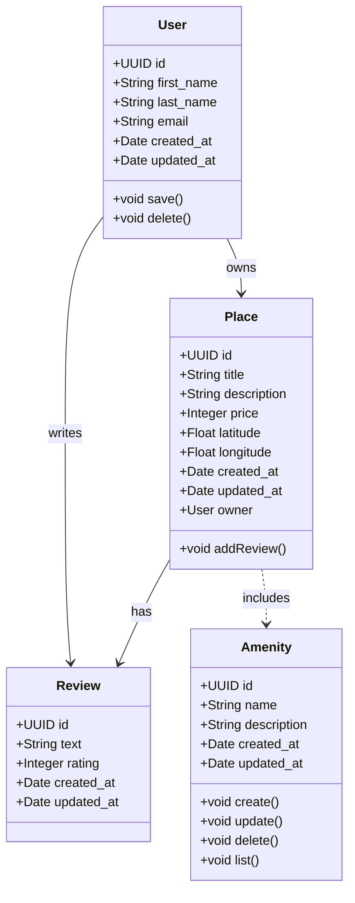

### 📄 Explanatory Notes

#### 🌟 Description of Each Entity

✅ **User**
The `User` class represents a person who interacts with the HBnB system. It includes the following attributes:
- `id`: a unique identifier (UUID4),
- `first_name` and `last_name`,
- `email`,
- `created_at` and `updated_at` timestamps.
Key methods are:
- `save()`: to save or update the user,
- `delete()`: to remove the user from the system.
The `User` entity is central to the system, as it can **own places** and **write reviews**.

✅ **Place**
The `Place` class models an accommodation in the system. Attributes include:
- `id`, `title`, `description`, `price`,
- `latitude` and `longitude`,
- `created_at` and `updated_at` timestamps.
- `owner`: a reference to the `User` who created and owns this place.
Key method:
- `addReview()`: to add a new review to the place.
The `Place` entity represents a physical location and connects to both reviews and amenities.

✅ **Review**
The `Review` class represents feedback from a user about a place. It includes:
- `id`, `text`, `rating`,
- `created_at` and `updated_at` timestamps.
Reviews provide essential insights for future guests.

✅ **Amenity**
The `Amenity` class represents additional features that a place can offer (like Wi-Fi, pool, parking). It includes:
- `id`, `name`, `description`,
- `created_at` and `updated_at` timestamps.
Amenities help distinguish places and enhance their attractiveness.

---

#### 💡 Explanation of Relationships

✅ **User → Place** (`owns`)
This relationship indicates that a user **owns** one or more places. It represents the ownership link between a user and the places they manage.

✅ **User → Review** (`writes`)
This relationship means that a user **writes** reviews for places they have visited or stayed in.

✅ **Place → Review** (`has`)
This relationship shows that a place **has** multiple reviews associated with it. It aggregates the feedback left by users.

✅ **Place → Amenity** (`includes`)
This relationship highlights that a place **includes** one or more amenities, showcasing the features and services offered.

---

**Overall, these relationships and classes define the core business logic of the HBnB Evolution application. They ensure that user interactions (writing reviews, managing places) and place features (amenities, reviews) are properly structured, enabling a scalable and maintainable system.**

